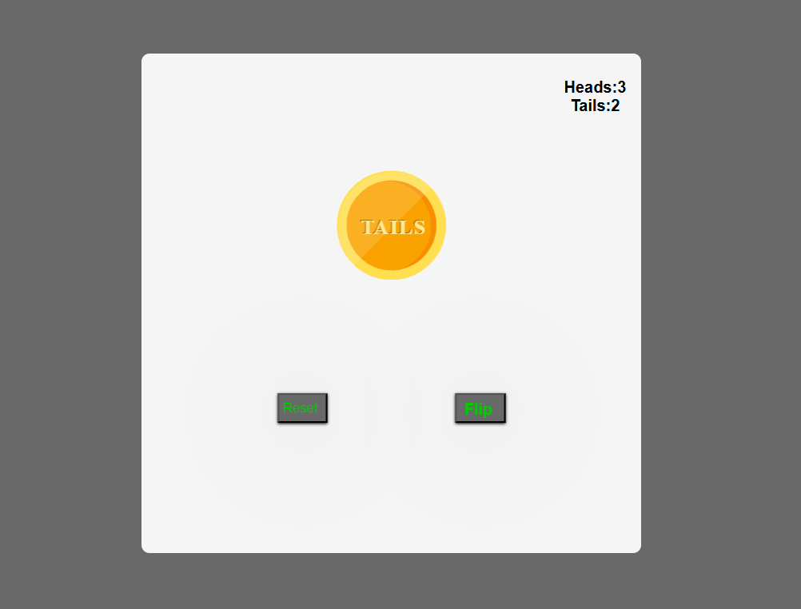

# 🪙 Toss – Flip a Coin Game  

Toss is a simple and fun **coin flip** game where you can test your luck and keep track of heads and tails counts. Perfect for making quick decisions or just having fun!  

## 🚀 Features  
✅ **Flip a Coin Instantly** – Click to flip and get a random result  
✅ **Track Scores** – Keep count of heads and tails  
✅ **Smooth Animations** – Realistic flipping effect  
✅ **Responsive Design** – Works on desktop and mobile  

## 🛠 Technologies Used  
- **Frontend:** HTML, CSS, JavaScript  
- **(Optional) Backend:** Node.js, Express.js (for saving scores)  

## 📦 Installation & Usage  



### 1️⃣ Clone the Repository  
```sh
git clone https://github.com/KIHs0/toss.git


